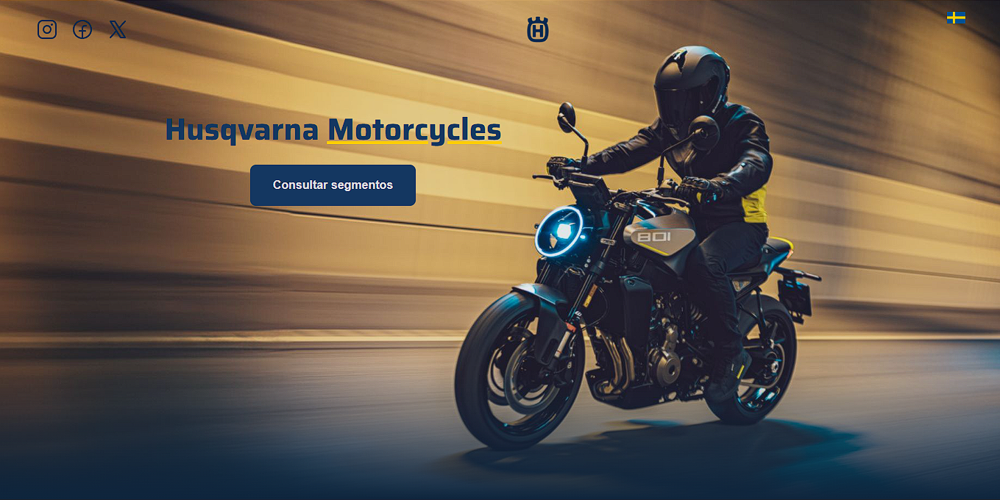

# Landing Page - HTML & CSS Practice
Responsive landing page built as a practice project to maintain and improve HTML and CSS layout skills.

## 📸 Preview

<!-- ## Demo -->
## 🧩 Features
- Responsive design (desktop, tablet, mobile)
- Layout built with Flexbox
- Semantic HTML structure
- Clean section organization
## 🛠️ Technologies
- HTML5
- CSS3
## 📚 What did i learned
- Handling breakpoints across devices
- Fixing overflow and spacing issues
- Adapting complex layouts to mobile
- Improving HTML structure and best practices
## 🔮 Next steps
- Add scroll-based animations with Javascript
- Optimize performance
## ‼️ Disclaimer ‼️
This project is a personal practice exercise.  It is not affiliated with or endorsed by any brand mentioned or represented.